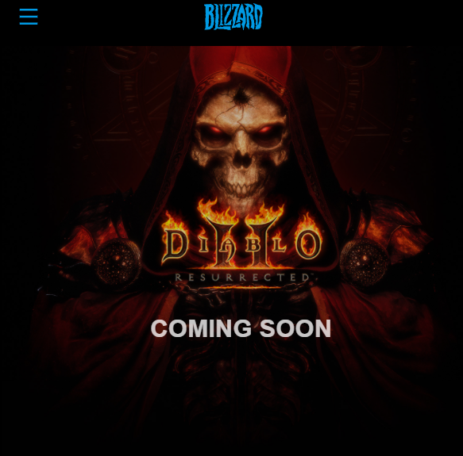

# Blizzard

Replication of [Blizzard's Entertainment's](https://www.blizzard.com/en-us/) website, known for developing and publishing games such as Call of Duty and World of Warcraft. Built to understand physics-based animations with React Spring. Developed with React, React-Spring(v9), Typescript.


### What I learned:

-   How to use React Spring to create physics- animations based on hooks.

## React Spring (v9)

-   useSpring to trigger animations once or for toggle animations.
-   useTransition to trigger whenever a hook value changes.
-   useTrail for stagger animations.
-   Created parallax mouseover animation.
-   Created card flip animation.

## External Resources:

-   React dev tool to check the value of props.

## What It Looks Like





# Getting Started

These instructions will get you a copy of the project up and running on your local machine for development and testing purposes.

1. Clone the project. Use `npm install` to install all the dependencies. Go to the client directory, run the project with `npm start` for development or `npm run build` for production.

# Prerequisites

What things you need to install the software

```
- Any package manager (npm, yarn)
```

# Versioning

None!
